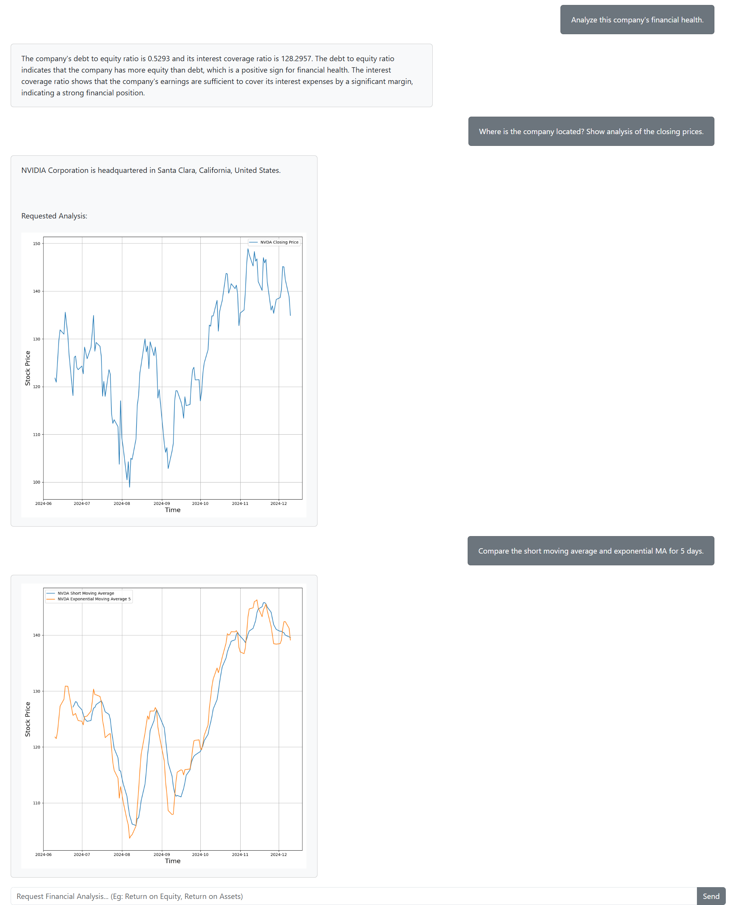

# FinBot 

### Project Description  
This project is a multi-agent system designed to function as a Junior Investment Analyst. It assists real analysts in evaluating publicly traded companies by performing both fundamental and technical analyses. The system simulates collaboration between specialized agents to generate detailed financial analysis for user-selected company.  



---

### Capabilities 
- **Fundamental Analysis**:  
  Calculate and report:  
    - Return on Equity (ROE)  
    - Return on Assets (ROA)  
    - Net Profit Margin  
    - Gross Margin  
    - Debt to Equity Ratio  
    - Interest Coverage Ratio  

- **Technical Analysis**:  
  Generate and visualize:  
    - Comparison of closing prices  
    - Simple moving averages (given window size or short and long windows)  
    - Exponential moving averages (given span)

- **Company Info**:

    Provides basic company info such as business summary.


---

### Setup and Running Instructions  

#### Prerequisites  
- Python 3.8+  
- Virtual environment (optional but recommended)  

#### Installation  
1. **Clone the repository**:  
   ```bash  
   git clone https://shahd2@bitbucket.org/shah-deep/finbot.git
   cd FinBot  
   ```  

2. **Set up a virtual environment**:  
   ```bash  
   python -m venv env  
   source env/bin/activate  # For Linux/macOS  
   .\env\Scripts\activate   # For Windows  
   ```  

3. **Install dependencies**:  
   ```bash  
   pip install -r requirements.txt  
   ```  

4. **Obtain the Cohere API key**:  
    - Go to [Cohere Dashboard](https://dashboard.cohere.com/api-keys).  
    - Generate your API key and note it down.  

5. **Add the API key to the environment**:  
    - Create a `.env` file in the project directory:  
      ```plaintext  
      COHERE_API_KEY=<your-api-key>  
      ```  

6. **Run the application**:  
    - Start the backend server:  
      ```bash  
      uvicorn backend.server:app --reload --host 127.0.0.1 --port 8000
      ```  
    - Start the front end:  
      ```bash  
      python frontend/app.py  
      ```  

---

### Architecture and Agent Design  

#### System Architecture  
- **Front End**:  
    - Built with Dash and Flask, the front end provides an intuitive interface for user interactions.  
    - Communicates with the backend via WebSocket connections for real-time updates.  

- **Backend Server**:  
    - Powered by FastAPI, the backend server listens for WebSocket connections and processes incoming queries.  
    - Upon connection, the server initializes the agent system to handle user requests dynamically.  

#### Agent System Architecture  
The multi-agent system is designed with the following components:  

- **Supervisor Agent**:  
    - Acts as the central controller.  
    - Forwards user messages to the appropriate agent:  
        - Fundamental Analysis Agent  
        - Technical Analysis Agent 
        - Company Info Agent  

- **Fundamental Analysis Agent**:  
    - Handles requests for financial metrics such as ROE, ROA, Net Profit Margin, etc.  
    - Retrieves and calculates the necessary data before returning the results.  

- **Technical Analysis Agent**:  
    - Handles requests for price trends and moving averages.  
    - Coordinates with:  
        - **Data Gathering Agent**: Fetches required data from financial data sources.  
        - **Plotting Agent**: Generates visualizations such as line graphs and moving average comparisons.  

- **Company Info Agent**:   
    - Provides basic company info such as company name and business summary. 


#### Design Highlights  
- **WebSocket Communication**: Ensures low-latency, real-time interactions between the front end and backend.  
- **Scalable Agent Framework**: Allows for easy integration of additional agents in the future.  
- **Layered Agent Design**: Modularized agents to handle specific tasks, improving clarity and scalability.  

---

### Challenges Faced and Solutions  

1. **Challenge**: Passing large data among the agents.  
    - **Solution**: Stored the data on the server and passed the reference information (e.g., IDs or paths) to retrieve them when required.  

2. **Challenge**: Communicating between Dash callbacks and WebSocket connections.  
    - **Solution**: Initially tried dash_extensions WebSocket, but it had issues sending messages on startup. Developed a custom connection module using asyncio, enabling WebSocket communication to run in a separate thread seamlessly.  
